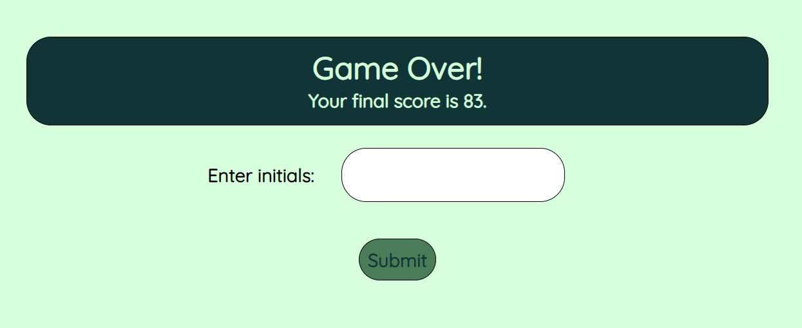

# JS Coding Quiz

## Description

As a coding bootcamp student I wanted a way to practice what I have learned about coding so far. I built this coding quiz as a means to test my knowledge of JavaScript concepts. Now that the basic quiz is built, I can add more questions to test myself on more concepts as they arise. I learned more about using JavaScript functions to do things like set a timer, show and hide elements, and loop through other functions.

## Installation

No installation required. Link to deployed application provided below:

https://andria-goodwin.github.io/js-coding-quiz/

## Usage

The JS Coding Quiz opens up on a welcome screen. The heading features a button to go the highscores page on the left and shows where the timer will be on the right. The page contains basic information about the quiz and a start button to begin the quiz. All clickable buttons, including the quiz options, will highlight when hovered.

When the start button is clicked, the user is presented with the first question and the timer starts to count down. When any option is clicked, the next question will appear. If the correct option is clicked, feedback will show "correct". If the incorrect option is selected, feedback will show "incorrect" and 10 seconds will be subtracted from the timer.

When the last question is answered the quiz shows a game over screen when the user can enter their initials and submit their score to be saved to local storage and shown on the highscores page.

When the submit button is clicked, the user is taken to the highscores page where they can see where their score ranks. This screen also has two buttons, one to go back to the quiz and another to clear the highscores from the page. This screen is also where the user is routed when clicking "view highscores" on the welcome screen.

## Credits

denise_rakestraw9. (n.d.). Javascript quiz flashcards. Quizlet. https://quizlet.com/117039332/javascript-quiz-flash-cards/ 

zaidkhan15. (2023, October 5). Create a quiz app with timer using HTML CSS and JavaScript. GeeksforGeeks. https://www.geeksforgeeks.org/create-a-quiz-app-with-timer-using-html-css-and-javascript/ 

## License

Please refer to the LICENSE in the repo.